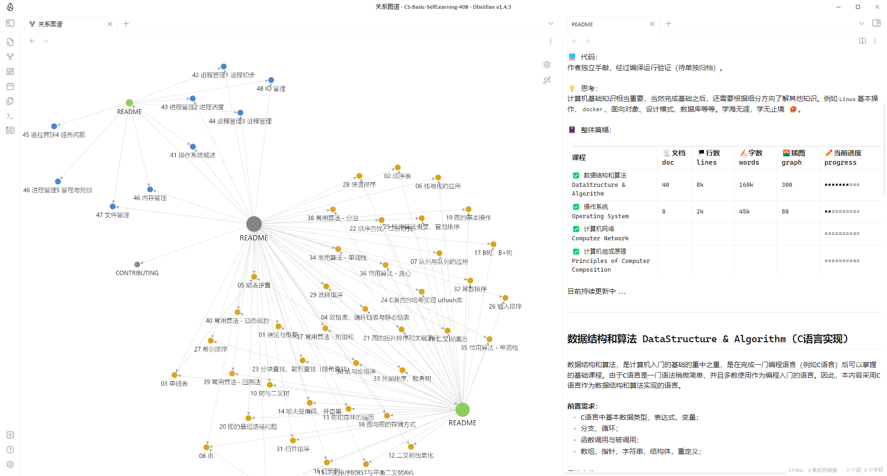

# 文档简介

💡 这是作者本人自学计算机基础课程的学习记录，主要包含计算机基础四大件，即大家常说的“408”。再学习过程中，本人采用[费曼学习法](https://www.youtube.com/watch?v=_f-qkGJBPts)，利用输出来强化学习效果，整理输出该文档。  
🚩 学习过程开启于2022年9月初，中间断断续续，一直持续更新记录。  
✅ 可以为自学计算机课程者，提供一份学习路径参考与内容借鉴。

-------------------------------------------------------------------

🔑 建议学习过程：   
**数据结构和算法** -> **计算机操作系统** -> **计算机网络** -> **计算机组成原理**，也并非要求一定严格有前有后，因为彼此之间内容有可能有所交叠。

📺 参考：  
主要参考王道系列辅导视频，对笔记内容进行了重新归类整理，并重新绘制了清晰美观的图片（主要还是个人对美学要求较高，喜欢配色统一、养眼舒服的插图），除此以外也纳入一些其他的开源文库补充。  

💻 代码：  
作者独立手敲，经过编译运行验证（待单独归档）。 

💡 思考：  
计算机基础知识相当重要，当然完成基础之后，还需要根据细分方向了解其他知识。例如`Linux`基本操作、`docker`、面向对象、设计模式、数据库等等。学海无涯，学无止境 🤣。

📓 整体篇幅：  

| 课程                                                     | 📃文档 doc | 🏴󠁫󠁩󠁬󠁿行数 lines | ✍🏻字数 words | 🌄插图 graph | ✏️当前进度 progress  |
| -------------------------------------------------------- | ---------- | ---------------- | ------------- | ------------ | -------------------- |
| ✅ 数据结构和算法  DataStructure & Algorithm          | 40         | 8k               | 180k          | 350          | ◾◾◾◾◾◾◾◽◽◽ |
| ✅ 操作系统        Operating System                   | 8          | 2k               | 70k           | 120           | ◾◾◽◽◽◽◽◽◽◽ |
| ✅ 计算机网络      Computer Network                   |            |                  |               |              | ◽◽◽◽◽◽◽◽◽◽ |
| ✅ 计算机组成原理  Principles of Computer Composition |            |                  |               |              |  ◽◽◽◽◽◽◽◽◽◽ |

目前持续更新中...

-------------------------------------------------------------------

# 数据结构和算法 DataStructure & Algorithm (C语言实现) 

数据结构和算法，是计算机入门的基础的重中之重，是在完成一门编程语言（例如C语言）后可以掌握的基础课程。由于C语言是一门语法稍微简单，并且多数使用作为编程入门的语言。因此，本内容采用C语言作为数据结构和算法实现的语言。

**前置需求**：
- C语言中基本数据类型、表达式、变量；
- 分支、循环；
- 函数调用与被调用；
- 数组、指针，字符串，结构体，重定义；
  
**具体章节**：
- [README](【DSA】数据结构与算法（C语言版本）/README.md)
- [x] [01 绪论与概要](【DSA】数据结构与算法（C语言版本）/01%20绪论与概要.md)
- [x] [02 顺序表](【DSA】数据结构与算法（C语言版本）/02%20顺序表.md)
- [x] [03 单链表](【DSA】数据结构与算法（C语言版本）/03%20单链表.md)
- [x] [04 双链表、循环链表与静态链表](【DSA】数据结构与算法（C语言版本）/04%20双链表、循环链表与静态链表.md)
- [x] [05 链表逆置（补充）](【DSA】数据结构与算法（C语言版本）/05%20链表逆置.md)
- [x] [06 栈与栈的应用](【DSA】数据结构与算法（C语言版本）/06%20栈与栈的应用.md)
- [x] [07 队列与队列的应用](【DSA】数据结构与算法（C语言版本）/07%20队列与队列的应用.md)
- [x] [08 串](【DSA】数据结构与算法（C语言版本）/08%20串.md)
- [x] [09 串的模式匹配 -- BF与KMP](【DSA】数据结构与算法（C语言版本）/09%20串的模式匹配%20--%20BF与KMP.md)
- [x] [10 树与二叉树](【DSA】数据结构与算法（C语言版本）/10%20树与二叉树.md)
- [x] [11 二叉树遍历](【DSA】数据结构与算法（C语言版本）/11%20二叉树遍历.md)
- [x] [12 二叉树线索化](【DSA】数据结构与算法（C语言版本）/12%20二叉树线索化.md)
- [x] [13 树和森林的遍历](【DSA】数据结构与算法（C语言版本）/13%20树和森林的遍历.md)
- [x] [14 哈夫曼编码、并查集](【DSA】数据结构与算法（C语言版本）/14%20哈夫曼编码、并查集.md)
- [x] [15 二叉排序树BST与平衡二叉树AVL](【DSA】数据结构与算法（C语言版本）/15%20二叉排序树BST与平衡二叉树AVL.md)
- [x] [16 红黑树](【DSA】数据结构与算法（C语言版本）/16%20红黑树.md)
- [x] [17 B树、B+树](【DSA】数据结构与算法（C语言版本）/17%20B树、B+树.md)
- [x] [18 图与图的存储方式](【DSA】数据结构与算法（C语言版本）/18%20图与图的存储方式.md)
- [ ] [19 图的基本操作](【DSA】数据结构与算法（C语言版本）/19%20图的基本操作.md)
- [ ] [20 图的最短路径问题](【DSA】数据结构与算法（C语言版本）/20%20图的最短路径问题.md)
- [ ] [21 图的拓扑排序和关键路径](【DSA】数据结构与算法（C语言版本）/21%20图的拓扑排序和关键路径.md)
- [x] [22 顺序查找、二分查找](【DSA】数据结构与算法（C语言版本）/22%20顺序查找、二分查找.md)
- [x] [23 分块查找、散列查找（哈希查找）](【DSA】数据结构与算法（C语言版本）/23%20分块查找、散列查找（哈希查找）.md)
- [x] [24 C语言的哈希实现 uthash库](【DSA】数据结构与算法（C语言版本）/24%20C语言的哈希实现%20uthash库.md)
- [x] [25 排序算法概要、冒泡排序](【DSA】数据结构与算法（C语言版本）/25%20排序算法概要、冒泡排序.md)
- [x] [26 插入排序](【DSA】数据结构与算法（C语言版本）/26%20插入排序.md)
- [x] [27 希尔排序](【DSA】数据结构与算法（C语言版本）/27%20希尔排序.md)
- [x] [28 快速排序](【DSA】数据结构与算法（C语言版本）/28%20快速排序.md)
- [x] [29 选择排序](【DSA】数据结构与算法（C语言版本）/29%20选择排序.md)
- [ ] [30 堆与堆排序](【DSA】数据结构与算法（C语言版本）/30%20堆与堆排序.md)
- [ ] [31 归并排序](【DSA】数据结构与算法（C语言版本）/31%20归并排序.md)
- [ ] [32 基数排序](【DSA】数据结构与算法（C语言版本）/32%20基数排序.md)
- [ ] [33 外部排序、败者树](【DSA】数据结构与算法（C语言版本）/33%20外部排序、败者树.md)
- [ ] [34 常用算法 - 单调栈](【DSA】数据结构与算法（C语言版本）/34%20常用算法%20-%20单调栈.md)
- [ ] [36 常用算法 - 贪心](【DSA】数据结构与算法（C语言版本）/36%20常用算法%20-%20贪心.md)
- [ ] [39 常用算法 - 回溯法](【DSA】数据结构与算法（C语言版本）/39%20常用算法%20-%20回溯法.md)
- [ ] [38 常用算法 - 分治](【DSA】数据结构与算法（C语言版本）/38%20常用算法%20-%20分治.md)
- [ ] [37 常用算法 - 前缀和](【DSA】数据结构与算法（C语言版本）/37%20常用算法%20-%20前缀和.md)
- [ ] [35 常用算法 - 单调栈](【DSA】数据结构与算法（C语言版本）/35%20常用算法%20-%20单调栈.md)
- [ ] [40 常用算法 - 动态规划](【DSA】数据结构与算法（C语言版本）/40%20常用算法%20-%20动态规划.md)

🔗课程链接：[数据结构_王道_哔哩哔哩_bilibili](https://www.bilibili.com/video/BV1b7411N798?p=2&vd_source=a7f0d42b9cbd9285a1aa3d740ec1b3af)
 
# 操作系统 Operating System
**操作系统是**控制管理计算机系统的硬软件，分配调度资源的**系统软件**，向上为上层软件提供接口，向下控制管理系统资源，是整个应用软件层和硬件层的中间过渡。操作系统课程分为四个部分：进程管理、内存管理、文件管理、I/O管理。
理解操作系统的功能和细节，常常需要将操作系统和现实世界联系起来，在这个课程中，我常常会摒弃掉一些无比复杂和专业性的词语、工整排比的特征分析，通过以现实世界的例子来理解，操作系统究竟干了哪些事情。

**具体章节**：
- [README](【OS】操作系统/README.md)
- [x] [41 操作系统概要、功能特征与发展演变](【OS】操作系统/41%20操作系统概要、功能特征与发展演变.md)
- [x] [42 操作系统运行机制、中断与异常、系统调用、体系结构](【OS】操作系统/42%20操作系统运行机制、中断与异常、系统调用、体系结构.md)
- [x] [43 进程管理1-进程切换、进程组织和管理](【OS】操作系统/43%20进程管理1-进程切换、进程组织和管理.md)
- [x] [44 进程管理2-进程间通信、多线程](【OS】操作系统/44%20进程管理2-进程间通信、多线程.md)
- [x] [45 进程管理3-调度与调度算法](【OS】操作系统/45%20进程管理3-调度与调度算法.md)
- [ ] [46 进程管理4-进程互斥、进程同步机制](【OS】操作系统/46%20进程管理4-进程互斥、进程同步机制.md)
- [ ] [47 进程管理5-生产者与消费者问题](【OS】操作系统/47%20进程管理5-生产者与消费者问题.md)
- [ ] [48 进程管理6-死锁](【OS】操作系统/48%20进程管理6-死锁.md)
- [x] [49 内存管理1-覆盖、交换、内存分配](【OS】操作系统/49%20内存管理1-覆盖、交换、内存分配.md)
- [x] [50 内存管理2-分页存储](【OS】操作系统/50%20内存管理2-分页存储.md)
- [ ] [51 内存管理3-分段存储](【OS】操作系统/51%20内存管理3-分段存储.md)

🔗课程链接：[操作系统_王道 哔哩哔哩_bilibili](https://www.bilibili.com/video/BV1YE411D7nH/?spm_id_from=333.337.search-card.all.click&vd_source=a7f0d42b9cbd9285a1aa3d740ec1b3af)

-------------------------------------------------------------------

# 计算机网络 Computer Network

具体章节：

🔗课程链接：
- [计算机网络微课堂_湖科大教书匠_哔哩哔哩_bilibili](https://www.bilibili.com/video/BV1c4411d7jb/?spm_id_from=333.337.search-card.all.click&vd_source=a7f0d42b9cbd9285a1aa3d740ec1b3af)
- [计算机网络_王道_哔哩哔哩_bilibili](https://www.bilibili.com/video/BV19E411D78Q/?spm_id_from=333.337.search-card.all.click)

-------------------------------------------------------------------

# 计算机组成原理 Principles of Computer Composition

具体章节：

🔗课程链接：
- [【CSAPP-深入理解计算机系统】哔哩哔哩_bilibili](https://www.bilibili.com/video/BV1cD4y1D7uR/?spm_id_from=333.788&vd_source=a7f0d42b9cbd9285a1aa3d740ec1b3af)
- [计算机组成原理_王道_哔哩哔哩_bilibili](https://www.bilibili.com/video/BV1ps4y1d73V/?spm_id_from=333.337.search-card.all.click)

-------------------------------------------------------------------

同步发布：
[知乎：非科班CS之路](https://www.zhihu.com/column/c_1573830979768328192)

# 编辑工具
本文档采用[Obsidian](https://obsidian.md/)、VScode工具编写，可以较好进行文档编辑以及结构化展示等效果。

# 社群维护
本仓库致力于对计算机基础知识的总结和回顾，由本人在学习时总结，也同步期待其他学习者能够一并协助，共同归档维护。  
参考贡献文档：[CONTRIBUTING](CONTRIBUTING.md)

# 作者简介 
双985的天坑专业，自学计算机上岸，现为大厂程序员。  
工作方向：云计算、网络传输、SDN、DPDK、容器、C/C++
