#数据结构 #算法 #C 

B树（英语：B-tree），是一种在计算机科学自平衡的树，能够保持数据有序。这种数据结构能够让查找数据、顺序访问、插入数据及删除的动作，都在对数时间内完成。  

B树，概括来说是一个一般化的二叉搜索树（binary search tree），一个结点可以拥有2个以上的子结点。与自平衡二叉查找树不同，B树适用于读写相对大的数据块的存储系统，例如磁盘。B树减少定位记录时所经历的中间过程，从而加快访问速度。B树这种数据结构可以用来描述外部存储。这种数据结构常被应用在数据库和文件系统的实现上。
# [62] B树
将原有的二叉查找树（BST），推广到N叉查找树，满足：结点内关键字有序，且子树的关键字也是有序的。如下图，即是一个五叉查找树。  
使用代码实现：
```c
struct Node {
    ElemType keys[4];        // 最多4个关键字
    struct Node *child[5];   // 最多5个孩子
    int num;                 // 结点中有几个关键字 
};
```

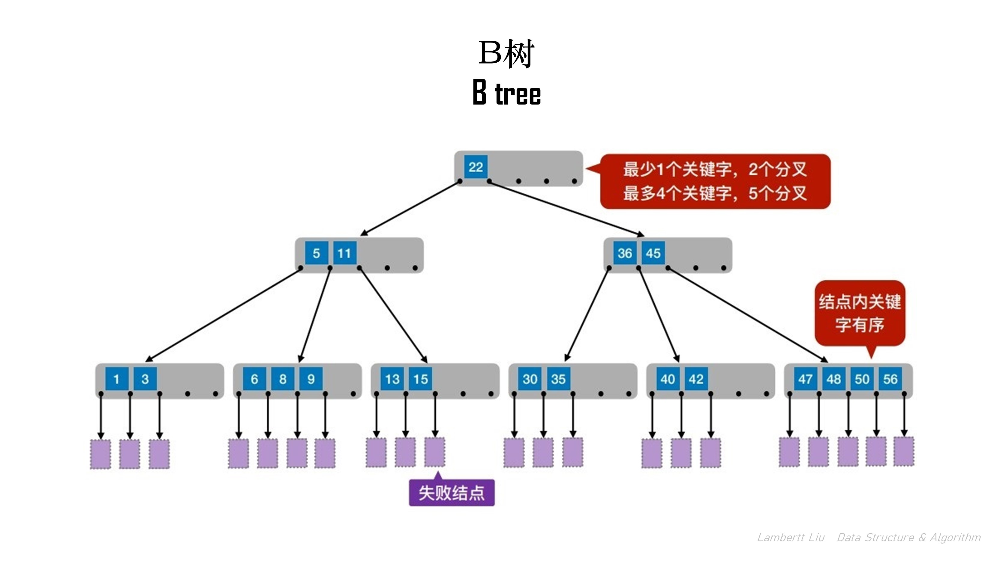

对于多叉查找树这样的数据结构查找方法，跟二叉排序树类似。当遇到小于结点的数的时候，会往左结点或者子树去搜索，当遇到大于结点的数的时候，会往右结点或者子树去搜索。   
【如何保证B树的查找效率？】   
如果每一个结点内的关键字太少，导致树的高度变高(如图)，所以需要查找更多层的结点，效率会更低。

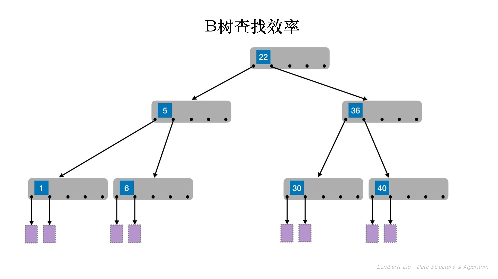

1. 可以采取策略，在一个M叉查找树中，规定除了根结点之外的所有结点，至少有 $⌈m / 2⌉$ 个分叉，即至少包含 $⌈m / 2⌉ - 1$ 个关键字。

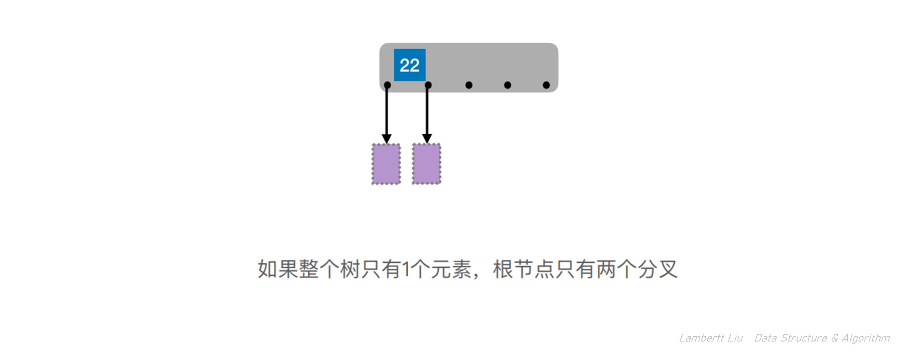
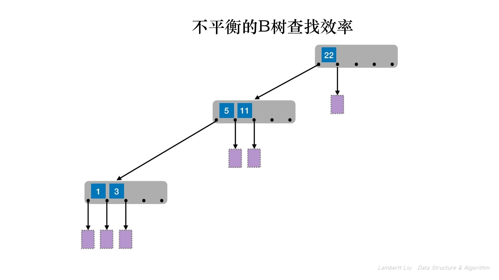

2. 可以采取策略，规定在任何一个结点，其所有子树的高度都要相同。

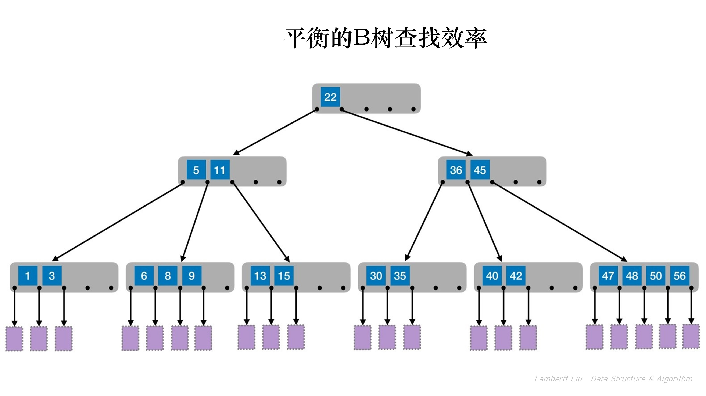

## 特点
B树，又称多路平衡查找树，B树中所有结点的孩子个数的最大值称为B树的阶，通常⽤`m`表示。

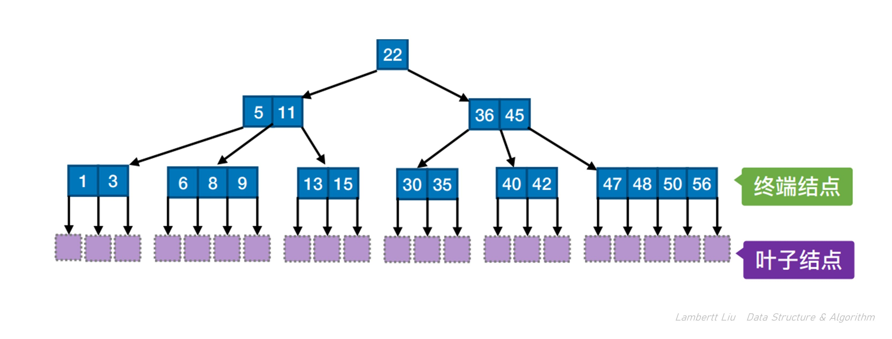

⼀棵`m`阶B树，或为空树，或为满足如下特性的`m`叉树： 
1. 树中每个结点至多有`m`棵子树，即至多含有`m-1`个关键字。 
2. 若根结点不是终端结点，则至少有两棵子树。 
3. 除根结点外的所有非叶结点 $⌈m / 2⌉$ 个子树，即至少包含 $⌈m / 2⌉ - 1$ 个关键字。 
4. 所有的叶结点都出现在同⼀层次上，并且不带信息（可以视为外部结点或类似于折半查找判定树的查找失败结点，实际上这些结点不存在，指向这些结点的指针为空）。
5. 所有非叶结点的结构如下:

| n   | K0  | P0  | K1  | P1  | K2  | ... | Kn  | Pn  |
| --- | --- | --- | --- | --- | --- | --- | --- | --- |

其中:
- $K_i(i = 1, 2,…, n)$ 为结点的关键字，且满⾜ $K_1 < K_2 <…< K_n$ ;
- $Pi(i = 0, 1,…, n)$ 为指向子树根结点 的指针，
- 且指针 $P_{i-1}$ 所指子树中所有结点的关键字均小于 $K_i$ ，$P_i$ 所指子树中所有结点的关键字均大于 $K_i$ ，n( $⌈m/2⌉- 1≤ n≤ m - 1$ )为结点中关键字的个数。

`m`阶B树的核⼼特性： 
- 根结点的子树数∈`[2, m]`，关键字数∈`[1, m-1]` ; 
- 其他结点的子树数∈`[⌈m/2⌉,m]`；关键字数∈`[⌈m/2⌉-1, m-1]` ;
- 对任⼀结点，其所有子树高度都相同; 
- 关键字的值：子树0<关键字1<子树1<关键字2<子树2<…. (类比⼆叉查找树：左<中<右)

# [63] B树的插入删除

## 插入
在插⼊key后，若导致原结点关键字数超过上限，则从中间位置（`⌈m/2⌉`）将其中的关键字**分为两部分**，左部分包含的关键字放在原结点中，右部分包含的关键字放到新结点中，中间位置（`⌈m/2⌉`）的结点插⼊原结点的父结点。

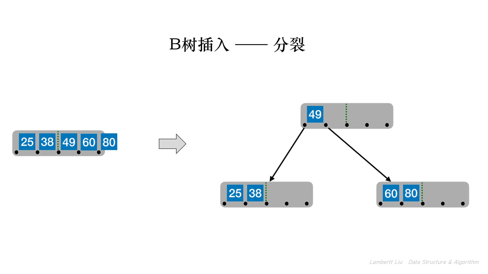

新元素⼀定是插入到最底层“终端节点”，⽤“查找”来确定插⼊位置。

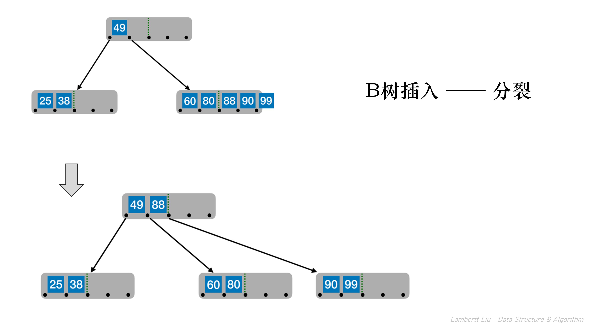


若此时导致其父结点的关键字个数也超过了上限，则继续进行这种分裂操作，直至这个过程传到根结点为⽌，进而导致B树高度增1。

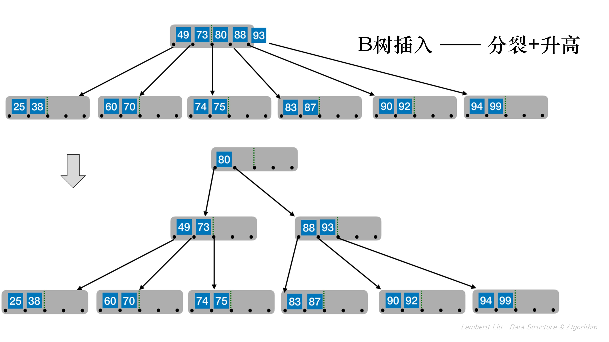

## 删除
- 若被删除关键字在非终端节点，则⽤直接前驱或直接后继来替代被删除的关键字——直接前驱：当前关键字左侧指针所指子树中“最右下”的元素。直接后继：当前关键字右侧指针所指子树中“最左下”的元素。这样，就可以将非终端结点，转化成终端结点的情况。

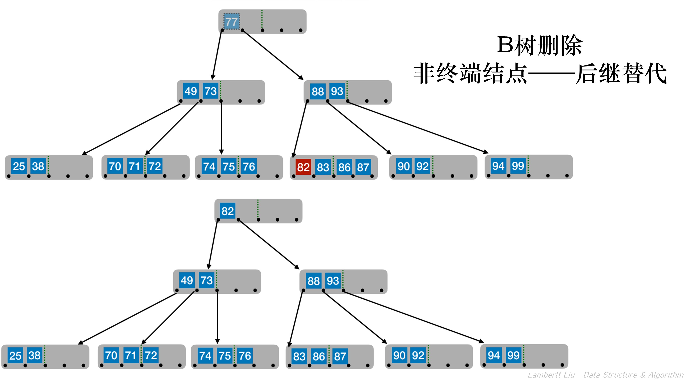
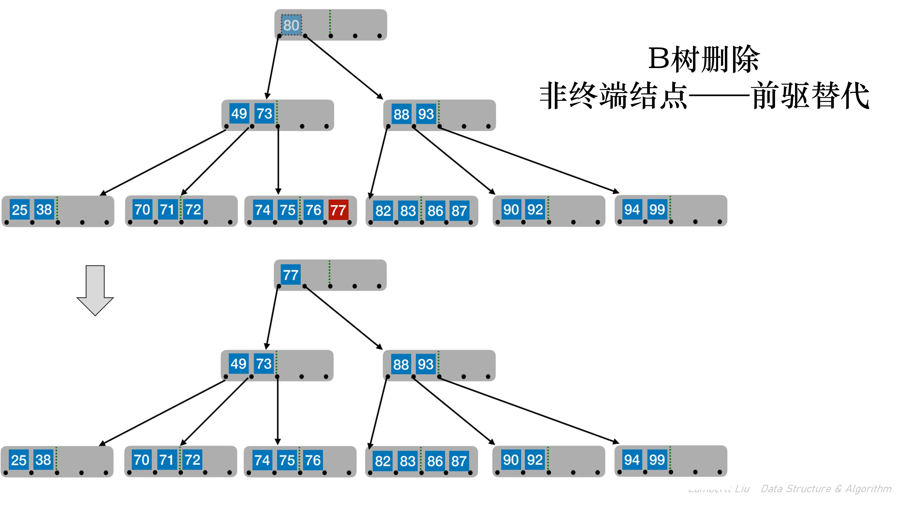

- 若被删除关键字在终端节点，则直接删除该关键字（要注意节点关键字个数是否低于下限 ⌈m/2⌉ − 1），当节点关键字不够的时候，需要采取特殊措施。
- 兄弟够借。
	- 若被删除关键字所在结点删除前的关键字个数低于下限，且与此结点右（或左）兄弟结点的关键字个数还很宽裕，则需要调整该结点、右（或左）兄弟结点及其双亲结点（⽗子换位法）。
	- 当左兄弟很宽裕时，⽤当前结点的前驱、前驱的前驱来填补空缺。
	- 当右兄弟很宽裕时，⽤当前结点的后继、后继的后继来填补空缺。
- 兄弟不够借。
	- 若被删除关键字所在结点删除前的关键字个数低于下限，且此时与该结点相邻的左、右兄弟结点的关键字个数均= ⌈m/2⌉ − 1，则将关键字删除后与左（或右）兄弟结点及双亲结点中的关键字进⾏合并。

# [64] B+树
B+树是一种树数据结构，通常用于数据库和操作系统的文件系统中。B+树的特点是能够保持数据稳定有序，其插入与修改拥有较稳定的对数时间复杂度。B+树元素自底向上插入，这与二叉树恰好相反。对比B树，B+树是B树的一种变形，比B树具有更广泛的应用。


## 特点
⼀棵`m`阶的B+树需满足下列条件： 
1. 每个分支结点最多有`m`棵子树（孩子结点）。 
2. 非叶根结点(分支结点)至少有两棵子树，其他每个分支结点至少有 ⌈m/2⌉ 棵子树。 
3. 结点的子树个数与关键字个数相等。 
4. 所有**叶结点包含全部关键字**及指向相应记录的**指针**，叶结点中将关键字按大小顺序排列，并且相邻叶结点按大小顺序相互链接起来。 
5. 所有分支结点中仅包含它的各个子结点中关键字的最大值及指向其子结点的指针。

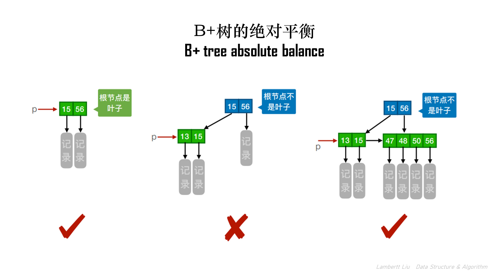

B+树中，⽆论查找成功与否，最终⼀定都要⾛到最下⾯⼀层结点。对比B树的查找，查找成功，可能停在任何⼀层。

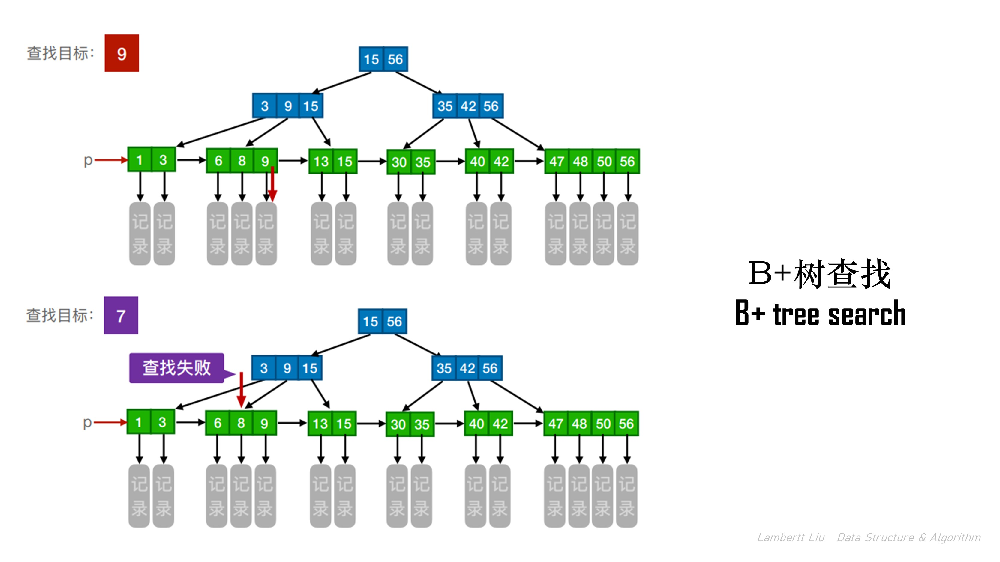

通过从根节点从上往下查找之外，也可以通过指向首个元素的指针来从头往后开始遍历，逐个节点往后找。

## 对比区别
| | m阶B+树                                                                    | m阶B树                                                          |
|---| -------------------------------------------------------------------------- | --------------------------------------------------------------- |
|1| 结点中的n个关键字对应n+1棵子树。                                             | 结点中的n个关键字对应n棵子树。                                    |
|2| 根节点的关键字数n∈[1, m] 其他结点的关键字数n∈[⌈m/2⌉, m] 。                  | 根节点的关键字数n∈[1, m-1]。 其他结点的关键字数n∈[⌈m/2⌉-1, m-1]。 |
|3| 在B+树中，叶结点包含全部关键字，非叶结点中出现过的关键字也会出现在叶结点中。 | 在B树中，各结点中包含的关键字是不重复的。  |
|4| 叶结点包含信息，所有非叶结点仅起索引作⽤，非叶结点中的每个索引项只含有对应子树的最大关键字和指向该子树的指针，不含有该关键字对应记录的存储地址。  | B树的结点中都包含了关键字对应的记录的存储地址。|


B+树的典型应⽤：关系型数据库的“索引”（如MySQL）：  
在B+树中，非叶结点不含有该关键字对应记录的存储地址。可以使⼀个磁盘块可以包含更多个关键字，使得B+树的阶更大，树高更矮， 读磁盘次数更少，查找更快。在**操作系统的文件管理**部分，会有B+树这类数据结构的详细应用。

#未完待续   
参考：[从数据页的角度看 B+ 树 | 小林coding (xiaolincoding.com)](https://www.xiaolincoding.com/mysql/index/page.html#innodb-%E6%98%AF%E5%A6%82%E4%BD%95%E5%AD%98%E5%82%A8%E6%95%B0%E6%8D%AE%E7%9A%84)


