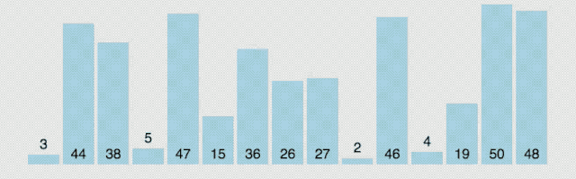

#数据结构 #算法 #C

排序算法是《数据结构与算法》中最基本的算法之一。
排序算法可以分为内部排序和外部排序：
- 内部排序是数据记录在内存中进行排序，
- 外部排序是因排序的数据很大，一次不能容纳全部的排序记录，在排序过程中需要访问外存。

常见的内部排序算法有：**插入排序、希尔排序、选择排序、冒泡排序、归并排序、快速排序、堆排序、基数排序**等。  
用一张图对比各算法：


名词解释：
- n：数据规模
- k："桶"的个数
- In-place：占用常数内存，不占用额外内存
- Out-place：占用额外内存
- 稳定性：排序后 2 个相等键值的顺序和排序之前它们的顺序相同。

# [83] 排序基本概念
## 1. 排序（Sort）
就是重新排列表中的元素，使表中的元素满⾜按关键字有序的过程。
- 输⼊： $n$  个记录 $R_1, R_2,…, R_n$ ，对应的关键字为 $k_1, k_2,…, k_n$ 。  
- 输出：输⼊序列的⼀个重排 $R_1ʹ, R_2ʹ,…, R_nʹ$，使得有 $k_1ʹ≤k_2ʹ≤…≤k_nʹ$ （也可递减）。  

## 2. 算法的稳定性
若待排序表中有两个元素 $R_i$ 和 $R_j$ ，其对应的关键字相同即 $key_i = key_j$ ，且在排序前 $R_i$ 在 $R_j$ 的前⾯，若**使⽤某⼀排序算法排序后**， $R_i$ 仍然在 $R_j$ 的前⾯，则称这个**排序算法是稳定的**，否则称排序算法是不稳定的。


稳定性的排序算法未必比不稳定算法要好，需要考虑场景：对稳定性是否需要，以及元素是否会出现关键词相同。
## 3. 内部排序与外部排序
- **内部排序**：数据都在内存中，关注如何使算法时、空复杂度更低。
- **外部排序**：数据太多，无法全部放入内存。还要关注如何使读/写磁盘次数更少。


排序算法可视化：[Data Structure Visualization (usfca.edu)](https://www.cs.usfca.edu/~galles/visualization/Algorithms.html)

# [88] 冒泡排序
冒泡排序（Bubble Sort），又称为泡式排序，是一种简单的排序算法。它重复地走访过要排序的数列，一次比较两个元素，如果它们的顺序错误就把它们交换过来。走访数列的工作是重复地进行直到没有再需要交换，也就是说该数列已经排序完成。这个算法的名字由来是因为越小的元素会经由交换慢慢“浮”到数列的顶端。


## 1.算法思想
冒泡排序是基于“**交换**（Swap）”的排序，根据序列中两个元素关键字的⽐较结果来对换这两个记录在序列中的位置。另外一种“交换排序”叫快速排序。
冒泡排序算法的运作如下：
1. 比较相邻的元素。如果第一个比第二个大，就交换它们两个。
2. 对每一对相邻元素作同样的工作，从开始第一对到结尾的最后一对。这步做完后，最后的元素会是最大的数。
3. 针对所有的元素重复以上的步骤，除了最后一个。
4. 持续每次对越来越少的元素重复上面的步骤，直到没有任何一对数字需要比较。

这个算法是最简单了解和实现的排序算法之一，但它对于包含大量的元素的数列排序是很没有效率的。
## 2.算法过程
从后往前（或从前往后）两两⽐较相邻元素的值，若为逆序，即 `array[i-1] > array[i]` ，则交换它们，直到序列比较完，称这样过程为“⼀趟”冒泡排序。

第⼀趟：排序使关键字值最⼩的⼀个元素“冒”到最前⾯。
第二趟：前边已经确定最终位置的元素不⽤再对⽐。结束后，最⼩的2个元素会“冒”到最前边。
第三趟：前边已经确定最终位置的元素不⽤再对⽐。结束后，最⼩的3个元素会“冒”到最前边。
.....

若某⼀趟排序没有发⽣“交换”，说明此时已经整体有序。

以第一趟为例：


第⼀趟排序结束，**关键字值最小**的⼀个元素“冒”到最前⾯。


第二趟结束后，最小的两个元素会“冒”到最前边。
接下来，进行第三趟和第四趟。


若某⼀趟排序没有发⽣“交换”，说明此时已经整体有序。
当第5趟结束的时候，整个表已经整体有序了，说明不需要再排列了。


冒泡排序中，从后往前（或从前往后）两两比较相邻元素的值，总共需进行 `n-1` 趟冒泡。

## 3.算法实现
```c
void swap(int &a, int &b)
{
    int temp = a;
    a = b;
    b = temp; 
}

void BubbleSort(int array[], int n)
{
    // i 所指位置之前的元素都已 “有序”
    for (int i = 0; i < n - 1; i++) {
        // 本趟冒泡是否发生交换的标志
        bool flag = false;              
        for (int j = n - 1; j > i; j--) {         // 一趟冒泡过程
            i f(array[j - 1] > array[j]) {            // 若为逆序
                swap(array[j - 1], array[j]);       // 交换
                flag = true;
            }
        }
        if (!flag) {
            // 本遍历后没有发生交换，说明表已经有序
            return;
        }
    }
}
```
## 4.算法性能
空间复杂度： $O(1)$
- 最好情况（有序）：比较次数 $n-1$; 交换次数 = 0  
    最好时间复杂度 $O(N)$
- 最坏情况（逆序）：比较次数，也就是交换次数 : 
$$(n-1)+(n-2)+…+1 = \frac{n(n-1)}{2}$$ 
  最坏时间复杂度 = $O(N^2)$ 
- 平均时间复杂度： $O(N^2)$

注意：`swap(a,b)` 每次交换都需要移动元素3次。
冒泡排序**同样适⽤于链表**，可从前往后“冒泡”，每⼀趟将更大的元素“冒”到链尾。
#未完待续 

参考：[一文搞定十大排序算法（动画图解）](https://cloud.tencent.com/developer/article/2008166)

