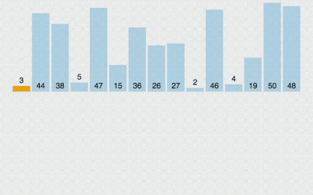

#数据结构 #算法 #C 

# [84] 插入排序
**插入排序**（英语：Insertion Sort）是一种简单直观的排序算法。它的工作原理是通过构建有序序列，对于未排序数据，在已排序序列中从后向前扫描，找到相应位置并插入。  
**插入排序**在实现上，通常采用in-place排序（即只需用到O(1)的额外空间的排序），因而在从后向前扫描过程中，需要反复把已排序元素逐步向后挪位，为最新元素提供插入空间。  
插入排序的过程和打扑克牌时类似，从牌桌上逐一拿起扑克牌，在手上的已有的牌进行排序。



## 1. 算法思想
每次将⼀个待排序的记录按其关键字大小插⼊到前⾯已排好序的⼦序列中，直到全部记录插⼊完成。
## 2. 算法过程
### 直接插入
1. 起始位置，默认第一项已经排列好，从第二项开始进行比较。比较较小，插入置前。


2. 对比发现已经是最大元素，放回原处。


3. 对比发现已经是最大元素，放回原处。


4. 从右至左，找到比它小的为止，将它插入这个位置


5. 从右至左，找到比它小的为止，将它插入这个位置


6. 从右至左，找到比它小的为止，将它插入这个位置


7. 从右至左，找到比它小的为止，将它插入这个位置，排序完成。


### 带哨兵的插入
可以参考顺序查找的方式，将数组的0位空闲出来，将元素存放在从0后的1开始的位置。


每次比较将数据存放在0号位，并将指针之前的数据与0号位置比较。
## 3. 算法实现
插入排序能够很明显地体现了递归思想，即每次插入其实都是在调用自己。
```c
// 直接插入排序
void InsertSort(int array[]; int n)
{
    int i, j, temp;
    for (i = 1; i < n; i++){            // 外层循环,逐个遍历
        if (array[i] < array[i - 1]){     // array[i] 小于前驱
            temp = array[i];            // array[i] 缓存进temp内
            /*
                在前i-1个数中，从后往前追溯，一旦遇到不大于temp的立即停止
                表现为出现比 temp 大的一直继续
            */
            for(j = i - 1; j >= 0 && array[j] > temp; j--){
                // 给temp 挪位置，原来的A[i] 被A[i-1]替换了，已经物是人非了
                array[j + 1] = array[j];    
            }
            // 把temp插到了它该存在的位置。
            array[j + 1] = temp;
        }
    }
}
```

如果使用带哨兵（sentinel）的方式，此时数组下标与位序一致。
```c
// 直接插入排序
void InsertSort(int array[]; int n)
{
    int i, j;
    // 外层循环,逐个遍历
    for (i = 2; i <= n; i++) {    
        if(array[i] < array[i - 1]){
            // 用哨兵存储将要排序的大数
            array[0] = array[i];
            // 从后往前依次对比，直至遇到 array[0] >= array[j]
            for(j = i - 1; array[0] < array[j]; j--){
                // 逐步后移    
                array[j + 1] = array[j];
            }
            // 在array[j] 后插入大数
            array[j + 1] = array[0];
        }    
    }
}
```
## 4. 算法性能分析
使用带哨兵的插入排序，优点即不用每轮都判断 `j >= 0`，运行效率略高一点。  
- 空间复杂度： $O(1)$  
- 时间复杂度： $O(N^2)$ 
    - 其中最好时间复杂度 $O(N)$ ，对应一个原本就有序的序列，那样每一个元素的对比次数都是1，只需要对比`n`次。
    - 最坏时间复杂度 $O(N^2)$  ，对应一个原本逆序的序列，每一个元素的对比次数都需要移动每一位。
    - 主要对比关键字、移动元素。若有 n 个元素，则需要 (n - 1) 趟。
- 算法稳定性：稳定排序

## 5. 算法优化
在插入时，将原来的遍历插入改变成折半插入。因为，原本的序列已经排过顺序，对于有序序列查找位置，可以在找寻插入位置的时候，采用二分查找。  
思路：先⽤二分查找找到应该插⼊的位置，再移动元素。


当 `low>high` 时折半查找停⽌，应将 `[low, i - 1]`内的元素全部右移，并将 `array[0]` 复制到 `low` 所指位置。

```c
// 折半插入查找，采用哨兵方式
void InsertSort(int array[], int n)
{
    int i, j, high, mid;
    // 外层循环,逐个遍历
    for (i = 2; i <= n; i++) {
        array[0] = array[i];
        // 设置折半查找的范围
        low = 1; high = i - 1;
        // 折半查找范围限制
        while (low <= high) {
            // 取半点
            mid = (low + high) / 2;
            // 查找左半 子表
            if (array[mid] > array[0]) {
                high = mid -1;
            } 
            // 查找又半子表
            else {
                low = mid + 1;
            }
        }
        // 统一后移，空出插入位置
        for (j = i - 1; j > high + 1; --j) {
            array[j + 1] = array[j];
        }
        // 在array[high]后插入完成
        array[high + 1] = array[0];
    }
}
```

采用二分查找插入，比起“直接插⼊排序”，比较关键字的次数减少了，但是移动元素的次数没变，整体来看时间复杂度依然是 $O(N^2)$ 。
对链表这类数据结构也可以进⾏插⼊排序，但是只能通过直接插入，按照顺序一一查找，因为链表不具备随机存取特点，无法进行二分查找。

## 6. 链表实现
例题：[147. 对链表进行插入排序 - 力扣（LeetCode）](https://leetcode.cn/problems/insertion-sort-list/description/)

给定单个链表的头 `head` ，使用 **插入排序** 对链表进行排序，并返回排序后链表的头。
**插入排序**算法的步骤:
1. 插入排序是迭代的，每次只移动一个元素，直到所有元素可以形成一个有序的输出列表。
2. 每次迭代中，插入排序只从输入数据中移除一个待排序的元素，找到它在序列中适当的位置，并将其插入。
3. 重复直到所有输入数据插入完为止。
对链表进行插入排序。

#未完待续 

程序实现：
```c
/**
 * Definition for singly-linked list.
 * struct ListNode {
 *     int val;
 *     struct ListNode *next;
 * };
 */

typedef struct ListNode Node;
struct ListNode* InsertionSortList(struct ListNode* head)
{
    // 链表为空或只有一个结点直接返回
    if (head == NULL || head->next == NULL) {
		return head;
	}
    // 定义新的链表，把原链表的每个结点有序插入到新链表中去
	Node* sorthead = head;
	Node* cur = head->next;
    Node* sorttail = head;  // 新链表的尾结点，方便尾插
    sorttail->next = NULL;  // 尾结点的next域置空
    while(cur){
        Node* sortcur = sorthead;
        Node* prev = NULL;
        // 原链表的cur结点在新链表中找到插入的位置
        while (sortcur && cur->val >= sortcur->val) { 
            prev = sortcur;
            sortcur = sortcur->next;
        }

        // 原链表的cur结点比新链表中每个结点都大，执行尾插
        if (sortcur == NULL) { 
            sorttail->next = cur;
            cur = cur->next;
            sorttail = sorttail->next;
            sorttail->next = NULL;
        }
        // cur结点比新链表中每个结点都小，执行头插
        else if (prev == NULL) { 
            Node* next = cur->next;
            cur->next = sorthead;
            sorthead = cur;
            cur = next;
        }
        // 不是尾插，也不是头插，指定位置插入
        else { 
            prev->next = cur;
            cur = cur->next;
            prev->next->next = sortcur;
        }
    }
    head = sorthead;
	return head;//返回原链表的头
}
```

虽然这种使用二分查找方法，移动元素的次数变少了，但是关键字对比的次数依然是 $O(N^2)$ 数量级，整体来看时间复杂度依然是 $O(N^2)$ 。


