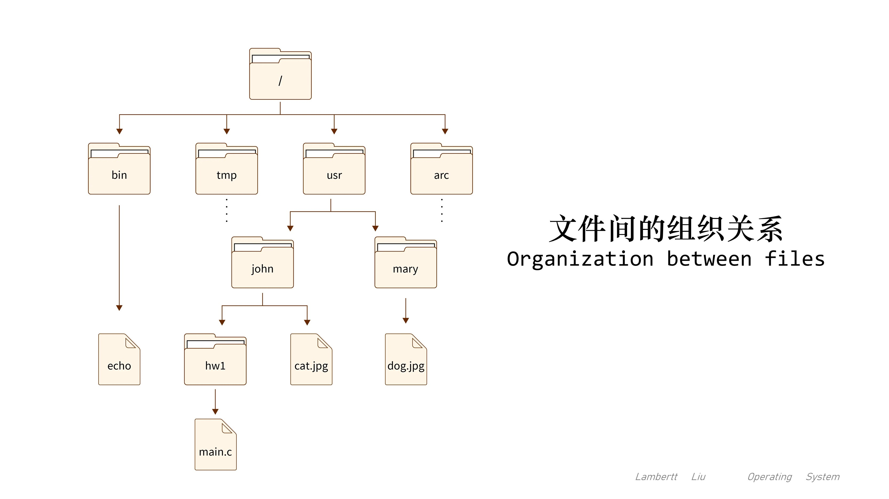

#操作系统 
# [50] 初识文件管理
文件, 就是一组有意义的信息/数据集合。


问题：
- 计算机中存放了各种各样的文件, 一个文件有哪些属性？ 
- **文件内部**的数据应该怎样组织起来？ 
- **文件之间**又应该又应该怎么组织起来？ 
站在操作系统的角度来看：
- 从下往上看, 操作系统应提供哪些功能, 才能方便用户、应用程序使用文件？ 
- 从上往下看, 文件数据应该怎么存放在外存(磁盘)上？

## 1.文件基本属性
- **文件名**：最基本的属性；由创建文件的用户决定文件名, 主要是为了方便用户找到文件, 同一目录下不允许有重名文件。
- **标识符**：一个系统内的各文件标识符唯一, 对用户来说毫无可读性, 因此标识符只是操作系统用于区分各个文件的一种内部名称。 
- **类型**：指明文件的类型。
- **位置**：文件存放的路径(让用户使用)、在外存中的地址(操作系统使用, 对用户不可见)。 
- **大小**：指明文件大小。
- **创建时间**、**上次修改时间**。
- **文件所有者信息**。 
- **保护信息**：对文件进行保护的访问控制信息。


## 2.内部的数据应该怎样组织起来
- 无结构文件(如文本文件), 由一些二进制或字符流组成, 又称“**流式文件**(stream)”
- 有结构文件(如数据库表), 由一条一条记录组成, 对于每一条记录, 由各相关数据项组成。

## 3.文件间的数据应该怎样组织起来
用户可以自己创建一层一层的目录, 各层目录中存放相应的文件。系统中的各个文件就通过一层一层的目录合理有序的组织起来了, 目录其实也是一种特殊的有结构文件(由记录组成)。所谓的“目录” 其实就是我们熟悉的“文件夹”。



## 4.操作系统应该向上提供哪些功能
- 创建文件(create 系统调用)
- 读文件(read 系统调用)
- 写文件(write 系统调用)
- 删除文件(delete 系统调用)
- 打开文件(open 系统调用)
- 关闭文件(close 系统调用)

可用几个基本操作完成更复杂的操作。  
比如：“复制文件”, 先创建一个新的空文件, 再把“源文件”读入内存, 再将内存中的数据写到新文件中。

## 5.从上往下看, 文件应如何存放在外存
操作系统以“块”为单位为文件分配存储空间, 因此即使一个文件大小只有10B, 但它依然需要占用 1KB 的磁盘块。外存中的数据读入内存时, 同样以块为单位。


类似于内存分为一个个“内存块”, 外存会分为一个个“块/磁盘块/物理块”。
每个磁盘块的大小是相等的, 每块一般包含2的整数幂个地址(如, 本例中, 一块包含2^10个地址, 即1KB)。同样类似的是, 文件的逻辑地址也可以分为(逻辑块号, 块内地址), 操作系统同样需要将逻辑地址转换为外存的物理地址(物理块号, 块内地址)的形式。块内地址的位数取决于磁盘块的大小。

文件数据放在离散的几个磁盘块中。此时, 应该如何记录各个磁盘块之间的先后顺序呢？这些需要后续的内容继续深入讨论。

# [51] 文件的逻辑结构
- “逻辑结构”，就是指在用户看来，文件内部的数据应该是如何组织起来的。
- “物理结构”，指的是在操作系统看来，文件的数据是如何存放在外存中的。

类似于数据结构的“逻辑结构”和“物理结构”。 
如“**线性表**”就是一种逻辑结构，在用户角度看来，线性表就是一组有先后关系的元素序列， “线性表”这种逻辑结构可以用不同的物理结构实现，如：顺序表，链表。
顺序表的各个元素在逻辑上相邻，在物理上也相邻；而链表的各个元素在物理上可以是不相邻的。因此，顺序表可以实现“随机访问”，而“链表”无法实现随机访问。可见，算法的具体实现与逻辑结构、物理结构都有关。

按文件是否有结构分类，可以分为无结构文件、有结构文件两种。 
## 1.无结构文件与有结构文件
- 无结构文件：
文件内部的数据就是一系列二进制流或字符流组成。又称“流式文件”。如：Windows 操作系统中的 .txt 文件。
- 有结构文件：
由一组相似的记录组成，又称“记录式文件”。每条记录又若干个数据项组成。如： 数据库表文件。一般来说，每条记录有一个数据项可作为关键字(作为识别不同记录的ID)，根据各条记录的长度(占用的存储空间)是否相等，又可分为定长记录和可变长记录两种。

根据有结构文件中的各条记录在逻辑上如何组织，可以分为三类：
## 2.顺序文件
- 顺序文件：
文件中的记录一个接一个地顺序排列(逻辑上)，记录可以是定长的或可变长的。各个记录在物理上可以**顺序存储**或**链式存储**。

## 3.索引文件
建立一张**索引表**以加快文件检索速度。每条记录对应一个索引项。


索引表本身是定长记录的顺序文件。因此可以快速找到第i个记录对应的索引项。可将关键字作为索引号内容，若按关键字顺序排列，则还可以支持按照关键字折半查找。 
每当要增加/删除一个记录时，需要对索引表进行修改。由于索引文件有很快的检索速度，因此主要用于对信息处理的及时性要求比较高的场合。
另外，可以用不同的数据项建立多个索引表。如：学生信息表中，可用关键字“学号”建立一张索引表。也可用“姓名”建立一张索引表。这样就 可以根据“姓名”快速地检索文件了。

## 4.索引顺序文件
索引顺序文件是索引文件和顺序文件思想的结合。索引顺序文件中，同样会为文件建立一张索引表，但不同的是：并不是每个记录对应一个索引表项，而是一组记录对应一个索引表项。

为了进一步提高检索效率，可以为顺序文件建立多级索引表。例如，对于一个含 106个记录的文件，可先 为该文件建立一张低级索引表，每 100 个记录为一组，故低级索引表中共有 10000 个表项(即10000个定长记录)，再把这 10000 个定长记录分组，每组100个，为其建立顶级索引表，故顶级索引表中共有 100 个表 项。

# [52] 文件目录
现在的操作系统，几乎文件结构，都会形成树状结构。例如Linux操作系统，使用`tree`命令，即可明确显示出文件的整体结构。


## 1.文件控制块
FCB(file control block)， 实现了文件名和文件之间的映射。使用户(用户程序)可以实现“按名存取”。

FCB的有序集合即称为“**文件目录**”，一个FCB就是一个文件目录项。 FCB中包含了文件的基本信息(文件名、物理地址、逻辑结构、物理结构等)，存取控制信息(是否可读/可写、禁止访问的用户名单等)，使用信息(如文件的建立时间、修改时间等)。 最重要，最基本的还是**文件名、文件存放的物理地址**。


可以对目录进行哪些操作？ 
- 搜索：当用户要使用一个文件时，系统要根据文件名搜索目录，找到该文件对应的目录项 
- 创建文件：创建一个新文件时，需要在其所属的目录中增加一个目录项 
- 删除文件：当删除一个文件时，需要在目录中删除相应的目录项 
- 显示目录：用户可以请求显示目录的内容，如显示该目录中的所有文件及相应属性 
- 修改目录：某些文件属性保存在目录中，因此这些属性变化时需要修改相应的目录项(如：文件重命名)。

## 2.目录结构演变
- 单级目录结构
早期操作系统并不支持多级目录，整个系统中只建立一张目录表，每个文件占一个目录项。单级目录实现了“按名存取”，但是不允许文件重名。这不适用于多用户操作系统。
- 两级目录结构
早期的多用户操作系统，采用两级目录结构。分为主文件目录(MFD, Master File Directory)和用户文件目录(UFD, User Flie Directory)。
- 多级目录结构
又称树形目录结构，根据绝对路径一层一层地找到下一级目录。用户会连续访问同一目录内的多个文件，因此可以设置一个“当前目录”。


- 无环图目录结构
以用不同的文件名指向同一个文件，甚至可以指向同一个目录(共享同一目录下的所有内容)。
- 索引结点
除了文件名之外的文件 描述信息都放到索引节点来，将大大提升文件检索速度。

# [53] 文件的物理结构(文件分配方式)
操作系统，需要对**非空闲磁盘块**(已有文件), **空闲磁盘块**(文件存储空间)进行统一管理。对文件的存储分为三种，连续分配、链式分配和索引分配。
## 1.连续分配(contiguous file allocation)
**文件存放在磁盘“连续的”物理空间中**。这种模式下，文件的数据都是紧密相连，**读写效率很高**，因为一次磁盘寻道就可以读出整个文件。
使用连续存放的方式有一个前提，必须先知道一个文件的大小，这样文件系统才会根据文件的大小在磁盘上找到一块连续的空间分配给文件。所以，**文件头里需要指定“起始块的位置”和“长度”**，有了这两个信息就可以很好的表示文件存放方式是一块连续的磁盘空间。


注意，此处说的文件头，就类似于 Linux 的 inode。

- 优点：
	对于直接访问(随机访问)和顺序访问，由起始块位置和长度址可以很容易地获得文件地址。查找起来非常快，因为由于文件块的连续分配，查找的数量最少。
- 缺点： 
	1. 这种方法存在内部和外部碎片化。这使得它在内存利用率方面效率低下。
	2. 增加文件大小很困难，因为它取决于特定实例中连续内存的可用性。


## 2.链式分配(linked file allocation)
链表的方式存放是**离散的，不用连续的**，于是就可以**消除磁盘碎片**，可大大提高磁盘空间的利用率，同时**文件的长度可以动态扩展**。


根据实现的方式的不同，链表可分为**隐式链接**和**显式链接**两种形式。
### 隐式链接
文件要以**隐式链表**的方式存放的话，**实现的方式是文件头要包含第一块和最后一块的位置，并且每个数据块里面留出一个指针空间，用来存放下一个数据块的位置**，这样一个数据块连着一个数据块，从链头开始就可以顺着指针找到所有的数据块，所以存放的方式可以是不连续的，如上图中的文件分配方式，即属于隐式链接。

- 缺点：
1. 无法直接访问数据块，只能通过指针顺序访问文件，
2. 数据块指针消耗了一定的存储空间。
3. **稳定性较差**，系统在运行过程中由于软件或者硬件错误**导致链表中的指针丢失或损坏，会导致文件数据的丢失。**

### 显式链接
如果取出每个磁盘块的指针，把它放在内存的一个表中，就可以解决上述隐式链表的两个不足。那么，这种实现方式是“**显式链接**”，它指**把用于链接文件各数据块的指针，显式地存放在内存的一张链接表中**，该表在整个磁盘仅设置一张，**每个表项中存放链接指针，指向下一个数据块号**。
对于显式链接的工作方式，我们举个例子，文件 A 依次使用了磁盘块 10、3 和 12 ，文件 B 依次使用了磁盘块 2、11、19、13、14、7 和 6 。利用下图中的表，可以从开始块开始，顺着链走到最后，找到文件 A 和B 的全部磁盘块。最后，这两个链都以一个不属于有效磁盘编号的特殊标记(如 0)结束。内存中的这样一个表格称为**文件分配表(File Allocation Table，FAT)**。


由于查找记录的过程是在内存中进行的，因而不仅显著地**提高了检索速度**，而且**大大减少了访问磁盘的次数**。但也正是整个表都存放在内存中的关系，它的主要的缺点是**不适用于大磁盘**。
比如，对于 200GB 的磁盘和 1KB 大小的块，这张表需要有 2 亿项，每一项对应于这 2 亿个磁盘块中的一个块，每项如果需要 4 个字节，那这张表要占用 800MB 内存，很显然 FAT 方案对于大磁盘而言不太合适。
FAT表一开机就会注入内存，并且运行时常驻内存。

## 3.索引分配(indexed file allocation)
链表的方式解决了连续分配的磁盘碎片和文件动态扩展的问题，但是不能有效支持直接访问(FAT除外)，索引的方式可以解决这个问题。
索引的实现是为每个文件创建一个**索引数据块**（这一点与链接式存储不同，FAT只会存文件头数据块），里面存放的是**指向文件数据块的指针列表**，说白了就像书的目录一样，要找哪个章节的内容，看目录查就可以。另外，**文件头需要包含指向索引数据块的指针**，这样就可以通过文件头知道索引数据块的位置，再通过索引数据块里的索引信息找到对应的数据块。


如图，文件`Jeep`的索引表存储在19号数据块内，打开这个数据块，里面存储了这个文件的索引表，表示这个文件的内容，分别顺序存在9、16、1、10、25这五个数据块内。（后面的-1表示为空）

创建文件时，索引块的所有指针都设为空。当首次写入第 i 块时，先从空闲空间中取得一个块，再将其地址写到索引块的第 i 个条目。
索引的方式优点在于：
- 文件的创建、增大、缩小很方便；
- 不会有碎片的问题；
- 支持顺序读写和随机读写；

## 4.链式索引
由于索引数据也是存放在磁盘块的，如果文件很小，明明只需一块就可以存放的下，但还是需要额外分配一块来存放索引数据，所以缺陷之一就是存储索引带来的开销。
如果文件很大，大到一个索引数据块放不下索引信息，这时又要如何处理大文件的存放呢？我们可以通过组合的方式，来处理大文件的存储。

先来看看链表 + 索引的组合，这种组合称为“**链式索引块**”，它的实现方式是**在索引数据块留出一个存放下一个索引数据块的指针**，于是当一个索引数据块的索引信息用完了，就可以通过指针的方式，找到下一个索引数据块的信息。那这种方式也会出现前面提到的链表方式的问题，万一某个指针损坏了，后面的数据也就会无法读取了。


## 5.多层索引
还有另外一种组合方式是索引 + 索引的方式，这种组合称为“**多级索引块**”，实现方式是**通过一个索引块来存放多个索引数据块**，一层套一层索引，像极了俄罗斯套娃。


# [54] 逻辑结构 V.S. 物理结构
- 文件的逻辑结构中的“**顺序文件的链式存储**”和文件的物理结构中的“**链式分配**”是什么区别？
- 文件的逻辑结构中的“**索引顺序文件**”和文件的物理结构中的“**链式索引**”是什么区别？

## 1.程序示例
```c
// 打开文件
FILE *fp = fopen("test.txt"，"w");
if (fp == NULL) {
	printf("打开文件失败!");
	exit(0);
}
// 写入1w个Hello world
for(int i = 0; i < 10000; i++)
{ 
	fputs("Hello world!", fp);
}
//关闭文件
fclose(fp);
```
该程序可以往示例文件中创建无结构文件。

从用户视角，每个字符占据1B，整个文件占用连续的一偏逻辑地址空间。
从操作系统视角，被操作系统拆分成若干个块的文件，逻辑块号相邻。
- 如果采用链接分配，逻辑上相邻的块在物理上用链接，指针表示先后关系。
- 如果采用索引分配，操作系统为每个文件维护一张索引表，其中记录了逻辑块号到物理块号的映射关系。

```c
typedef struct {
	int number;
	char name[30];
	char major[30];
} Student info;

// 以"写"方式打开文件
FILE *fp = fopen("students.info","w");
if (fp == NULL)
{
	printf("打开文件失败!");
	exit(0);
}

// 用数组保存N个学生信息
Student info student[N];
for (int i = 0; i < N; i++){ //生成 N 个学生信息
	student[i].number = i;
	student[i].name[0] = '?';
	student[i].major[0] = '?';
}

//将 N 个学生的信息写入文件
fwrite(student, sizeof(Student_info), N, fp);
fclose(fp);

//以"读"方式打开文件
FILE *fp = fopen("students.info","r");
if (fp == NULL) {
	printf("打开文件失败!");
	exit(0);
}
// 用户用逻辑地址访问文件
// 文件读写指针指向编号为5的学生记录
fseek(fp, 5*sizeof(Student_info)，SEEK _SET);
Student info stu;

// 从文件读出1条记录，记录大小为 sizeof(Student_info)
fread(&stu,sizeof(Student_info), 1, fp);
printf("学生编号:%d\n"，stu.number);
fclose(fp);
```

文件内部各条记录，采用什么方式存储。由创建文件的用户自己设计的。
文件整体用链接分配：由操作系统决定，二者起始没有相互关系。用户设计信息组织，而操作系统，负责将逻辑地址转化成逻辑块号、块内偏移量的形式，并负责将实现逻辑块号到物理块号的映射。