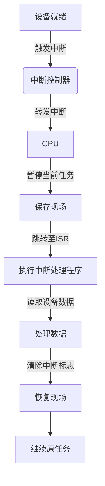

#操作系统 

# [60] I/O 设备的概念和分类
操作系统对CPU管理、存储器管理、文件管理属于对内部的管理，而对设备的管理属于对外部设备的管理。对 I/O 设备的管理是一个分层、模块化的综合体系，旨在解决设备多样性、速度不匹配、安全共享等问题，同时为用户提供统一易用的接口。


## ⚙️ 1. I/O 设备的分类与管理目标
1. ​**​设备分类​**​
    - ​**​按传输速率​**​：低速（键盘/鼠标）、中速（打印机）、高速（磁盘）   
    - ​**​按数据单位​**​：
        - ​**​字符设备​**​（键盘/串口）：以字节为单位，不可寻址，采用中断驱动     
        - ​**​块设备​**​（磁盘）：以数据块为单位，可随机寻址，支持 DMA 传输 
    - ​**​按共享性​**​：独占设备（打印机）、共享设备（磁盘）、虚拟设备（通过 SPOOLing 技术实现）

2. ​**​管理目标​**​
    - ​**​效率​**​：通过缓冲、异步 I/O 等技术缓解 CPU 与设备的速度差异
    - ​**​通用性​**​：提供统一的系统调用接口（如 `read()`/`write()`）
    - ​**​安全性​**​：通过文件权限模型控制设备访问（如 Unix 将设备抽象为 `/dev` 下的文件）

Unix系统将外部设备抽象成一种特殊的文件，用户可以使用与文件操作系统的方式对外部设备进行操作。


## 🔄 2. I/O 控制方式的演进
操作系统通过四级控制方式减少 CPU 干预，提升并行性：

|​**​控制方式​**​|​**​特点​**​|​**​适用场景​**​|
|---|---|---|
|​**​程序轮询​**​|CPU 持续检测设备状态，串行工作，效率低|早期无中断的系统|
|​**​中断驱动​**​|设备就绪后中断 CPU，实现 CPU/设备并行，但每次传输需中断|低速设备（键盘）|
|​**​DMA​**​|由 DMA 控制器管理数据块传输，仅开始/结束时中断 CPU|块设备（磁盘）|
|​**​通道控制​**​|专用 I/O 处理器执行通道程序，实现 CPU、通道、设备三级并行|大型服务器系统|

> 💡 ​**​趋势​**​：硬件参与度递增，CPU 干预递减，并行性提升。DMA 和通道是高性能系统的关键。

## 🛠️ 3.核心管理技术
1. ​**​缓冲机制​**​
    - ​**​目的​**​：平滑 CPU 与设备的速度差异，减少中断频率
    - ​**​类型​**​：单缓冲、双缓冲（解决双向传输）、循环缓冲、公共缓冲池
2. ​**​设备分配与调度​**​
    - ​**​安全分配​**​：进程获得设备后阻塞直至 I/O 完成（避免死锁）
    - ​**​调度算法​**​：磁盘寻道优化（如 ​**​SCAN 算法​**​）、优先级调度等
3. ​**​错误处理​**​
    - 区分临时错误（重试）与永久错误（设备下线），向上层屏蔽硬件细节

## 🌐 4. 虚拟化与高级技术
1. ​**​SPOOLing（假脱机）​**​
    - 将独占设备虚拟为共享设备，如​**​打印机共享​**​：
        1. 用户数据暂存磁盘输出井
        2. 后台进程按队列顺序实际打印  
2. ​**​设备虚拟化​**​
    - 虚拟机通过 ​**​I/O 通道​**​模拟物理设备，由 Hypervisor 接管硬件访问

# [61] I/O 控制器
CPU无法直接控制 I/O设备的机械部件，因此I/O 设备还要有一个电子部件作为CPU和I/O设备机械部门之间的“中介”，用于实现CPU对设备的控制。这个部件就是I/O控制器（Input/Output Controller），又称设备控制器，CPU通过I/O控制器来控制设备。


## ⚙️ 1. 核心功能
1. ​**​命令解析与执行​**​
    - 接收并识别CPU指令（如`read/write`），通过**控制寄存器**存储命令参数
2. ​**​状态监控与报告​**​
    - 通过**状态寄存器**反馈设备状态（如“忙碌/空闲”），供CPU查询
3. ​**​数据缓冲与交换​**​
    - **数据寄存器**暂存传输中的数据，缓解CPU与设备的速度差异（如键盘输入低速，内存读写高速）
4. ​**​地址识别​**​
    - 识别CPU指定的寄存器地址（如数据寄存器 vs. 控制寄存器），确保操作精准定位
5. ​**​数据格式转换​**​
    - 完成串行/并行转换（如主机侧并行传输，设备侧串行传输）

## 🧩 2.硬件组成
I/O控制器本质是一块集成电路芯片。对外提供两个接口，一个用于与CPU进行交互，一个用于和外部设备交互。


常集成于主板，因此主要对外提供两种接口：与CPU的接口和与设备的接口。
内部的IO逻辑，负责接收和识别CPU的各种命令（比如地址译码），并负责对设备发出命令。包含三类核心寄存器：
- ​**​数据寄存器（DR）​**​：暂存输入/输出的数据。
- ​**​控制寄存器（CR）​**​：存储CPU下发的命令参数（如读写方向）
- ​**​状态寄存器（SR）​**​：记录设备状态（如“就绪/错误”）

此外，DMA控制器等专用硬件可能集成地址寄存器（MAR）、计数器（DC）等，支持高效块数据传输。

## 🔢 3.编址方式：CPU如何访问寄存器？
1. ​**​统一编址（内存映射I/O）​**​
    - I/O寄存器占用内存地址空间，CPU用访存指令（如`MOV`）直接操作。
    - ​**​优点​**​：编程灵活，无需专用指令；​**​缺点​**​：挤占内存空间。
2. ​**​独立编址（I/O映射）​**​
    - I/O寄存器有独立地址空间，需专用指令（如`IN/OUT`）访问。
    - ​**​优点​**​：不占用内存，译码快；​**​缺点​**​：指令功能受限。

## 🔧 4.类型与适用场景

|​**​分类方式​**​|​**​类型​**​|​**​特点​**​|​**​典型设备​**​|
|---|---|---|---|
|​**​数据传输方式​**​|并行接口|多位同时传输，速度快|老式打印机|
||串行接口|逐位传输，距离远抗干扰|USB设备、串口鼠标|
|​**​控制方式​**​|程序查询接口|CPU轮询状态，简单但效率低|嵌入式传感器|
||中断接口|设备就绪后中断CPU，支持并行|键盘、鼠标|
||DMA接口|直接内存访问，块传输少中断|磁盘、网卡|
|​**​灵活性​**​|可编程接口|软件配置功能（如波特率）|现代通用接口|
||不可编程接口|功能固定|简单开关设备|

## 💻 5.与操作系统的协作
- ​**​驱动程序​**​：操作系统通过设备驱动将高层指令（如`read()`）转为控制器可识别的寄存器操作。
- ​**​中断处理​**​：设备完成操作后触发中断，CPU暂停当前任务执行中断服务程序。
- ​**​缓冲管理​**​：控制器配合OS的缓冲区机制（如磁盘缓冲池），减少频繁中断。

## 💎 总结
I/O控制器是计算机I/O系统的“交通枢纽”，​**​承上启下​**​：对上解析CPU命令，对下操控设备硬件，通过寄存器交互、格式转换、缓冲协调实现高效数据传输。其设计直接影响系统性能，如DMA控制器大幅提升块设备吞吐，而编址方式则权衡了编程灵活性与硬件成本
理解I/O控制器，是掌握计算机体系结构及操作系统设备管理的基础。

# [62] I/O 控制方式
I/O 控制方式是计算机系统中管理外部设备与内存/CPU 之间数据传输的核心机制，旨在平衡效率、成本与复杂度。以下是四种主流方式的详细解析：

### ⚙️ ​**​1. 程序直接控制方式（轮询 Polling）​**​
​**​控制原理​**​：  
CPU 持续轮询设备控制器的状态寄存器，检测设备是否就绪。若设备忙则循环等待；若就绪则通过 CPU 寄存器中转一个字（或字节）的数据到内存。

```plaintext
+-------------------+     发送命令      +-------------------+
|                   | ---------------->|                   |
|       CPU         |                  |   I/O设备控制器    |
|                   | <--------------- |                   |
+-------------------+   读取状态寄存器  +-------------------+
          |                               |
          |         设备忙？(状态=0)      |
          |------------------否-----------|
          |                               
          | 是（状态=1）                 
          |                               
          v                               
+-------------------+                     
| 传输单字数据       |                     
| (CPU→内存或反之)   |                     
+-------------------+                     
```
​
**​硬件依赖​**​：仅需基础控制器，无需中断或 DMA 硬件支持。  
​**​典型场景​**​：低速设备（如早期打印机）、嵌入式传感器。  
​**​优缺点​**​：
- ✅ 实现简单，调试方便；
- ❌ CPU 利用率极低（忙等待），设备与 CPU 串行工作。

### 🔄 ​2. 中断驱动控制方式（Interrupt-Driven）​​
​**​控制原理​**​：
1. CPU 启动设备后转去执行其他任务；
2. 设备就绪后主动向 CPU 发送中断请求；
3. CPU 暂停当前任务，执行中断服务程序（ISR），通过寄存器中转一个字的数据。  



​**​硬件依赖​**​：需中断控制器支持。  
​**​典型场景​**​：交互式设备（键盘、鼠标），实时响应要求高的场景。  
**优缺点​**​：
- ✅ CPU 与设备并行，利用率提升；
- ❌ 频繁中断导致上下文切换开销大，仍以字为单位传输

## 🚀 ​​3. DMA 方式（Direct Memory Access）​
DMA（Direct Memory Access，直接内存访问）是一种允许外设与内存直接交换数据的技术，无需CPU干预每字节的传输，从而大幅提升系统效率。

DMA通过​**​专用硬件控制器（DMAC）​**​ 接管数据传输任务，解决CPU在传统I/O中的瓶颈问题。DMA传输的四大步骤​：
### 1.初始化阶段（CPU配置DMAC）​​
- ​**​任务​**​：CPU设置DMAC的寄存器参数，定义传输规则。
- ​**​关键参数​**​：
    - ​**​源地址​**​：数据起始位置（如外设寄存器地址或内存地址）。
    - ​**​目标地址​**​：数据目的地（如内存缓冲区或外设寄存器）。
    - ​**​传输长度​**​：数据总量（字节/字/块）。
    - ​**​传输方向​**​：内存→外设、外设→内存或内存→内存。
    - ​**​地址自增​**​：内存地址通常自增，外设地址固定（如串口数据寄存器）
### 2.请求与响应阶段（总线仲裁）​​
- ​**​DMA请求（DREQ）​**​：外设（如磁盘、网卡）准备好数据后，向 DMAC 发送请求信号。
- ​**​总线占用请求（HOLD）​**​：DMAC向CPU发送总线控制权请求。
- ​**​CPU响应（HLDA）​**​：CPU完成当前总线周期后释放总线，回复HLDA信号授权DMAC接管。
### ​3.数据传输阶段（DMAC控制总线）​​
- ​**​直接操作​**​：DMAC接管总线，按配置参数读写数据：
    - ​**​单字节传输​**​：逐字节搬运（基础模式）。
    - ​**​突发传输（Burst）​**​：连续传输多个数据单元（如一次传4个字），减少总线切换次数。
- ​**​地址更新​**​：根据初始化配置自动递增源/目标地址。
- 这一阶段，不需要数据经过CPU直接在内存和IO设备之间交换
### ​​4.结束阶段（释放总线与通知）​​
- ​**​释放总线​**​：传输完成后，DMAC释放总线控制权，CPU恢复执行。
- ​**​中断通知​**​：DMAC向CPU发送中断信号，触发中断服务程序（ISR）处理后续任务（如数据校验、缓冲区切换）

​**​典型场景​**​：高速块设备（磁盘、SSD、网卡）
​**​优缺点​**​：
- ✅ 数据传输无需 CPU 中转，效率大幅提升；
- ❌ 仅支持连续数据块传输，离散数据需多次中断。

## 🧠 ​​4. 通道控制方式（Channel I/O）​
通道，可以认定是裁剪版的CPU，它可以识别一系列的通道指令。
​**​控制原理​**​：
1. CPU 向通道处理器发送 I/O 指令及通道程序地址；
2. 通道自主执行通道程序（含多条 I/O 指令），控制多台设备并行传输一组数据块；
3. 完成所有操作后向 CPU 发送单一中断。  

​**硬件依赖​**​：需专用通道处理器（简化版 CPU），可执行定制指令。  
​**​典型场景​**​：大型机、数据中心服务器（高并发 I/O，如数据库、金融系统）。  
​**​优缺点​**​：
- ✅ CPU 干预极少，支持多设备并发与复杂调度；
- ❌ 硬件成本高，生态依赖厂商驱动

## 💎 5. ​**​核心演进逻辑​**​
I/O 控制方式的演进始终围绕**​减少 CPU 干预、提升并行性​**​：
1. ​**​解放 CPU​**​：从轮询（CPU 全程阻塞）→ 中断（CPU 可并行）→ DMA/通道（CPU 近乎零参与）；
2. ​**​扩大传输单位​**​：字 → 块 → 一组块，降低单位数据的管理开销；
3. ​**​硬件协同升级​**​：中断控制器 → DMA 控制器 → 通道处理器，专用硬件分担 CPU 负载。


# [64] I/O 软件层次结构

# [65] I/O 核心子系统

# [66] 假脱机技术

# [67] 设备的分配与回收

# [68] 缓冲区管理
